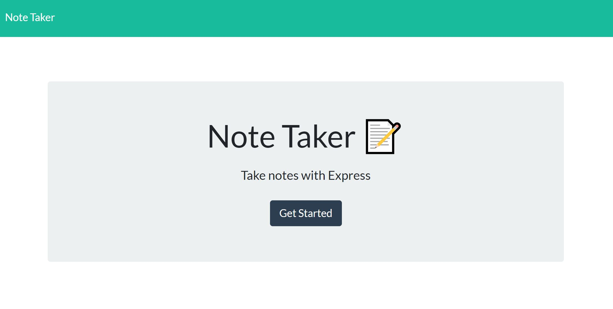
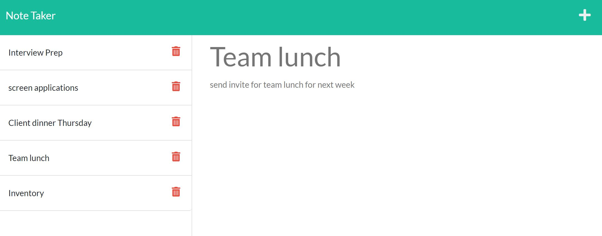

# 11-Express.js-Note-Taker

The purpose of this challenge is to modify given starter code (the front end of the application) to create an application called Note Taker that can be used to write and save notes. The backend of the application is using Express.js and will save and retrieve note date from a JSON file.

In this app you can write, save and delete notes.

## Acceptance Criteria

GIVEN a note-taking application  
WHEN I open the Note Taker  
THEN I am presented with a landing page with a link to a notes page  
WHEN I click on the link to the notes page  
THEN I am presented with a page with existing notes listed in the left-hand column,  
plus empty fields to enter a new note title and the note’s text in the right-hand column  
WHEN I enter a new note title and the note’s text  
THEN a Save icon appears in the navigation at the top of the page  
WHEN I click on the Save icon  
THEN the new note I have entered is saved and appears in the left-hand column with the other existing notes  
WHEN I click on an existing note in the list in the left-hand column  
THEN that note appears in the right-hand column  
WHEN I click on the Write icon in the navigation at the top of the page  
THEN I am presented with empty fields to enter a new note title and the note’s text in the right-hand column

## Screenshots

- Screenshot of homepage
  

- Screenshot of page with some saved notes
  

## Links

- [GitHub Repository](https://github.com/HenniePenny/11-Express.js-Note-Taker)
- [Link to Heroku Deployment](https://limitless-island-12230.herokuapp.com/)
